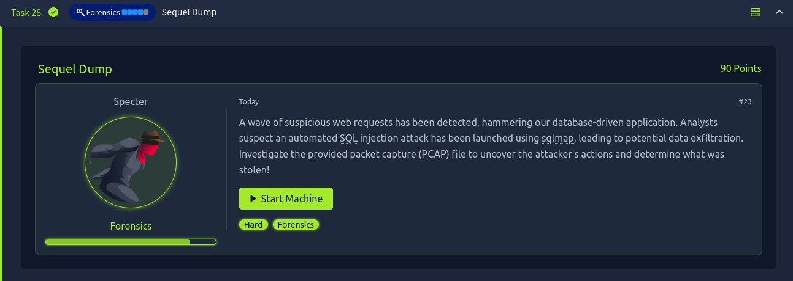
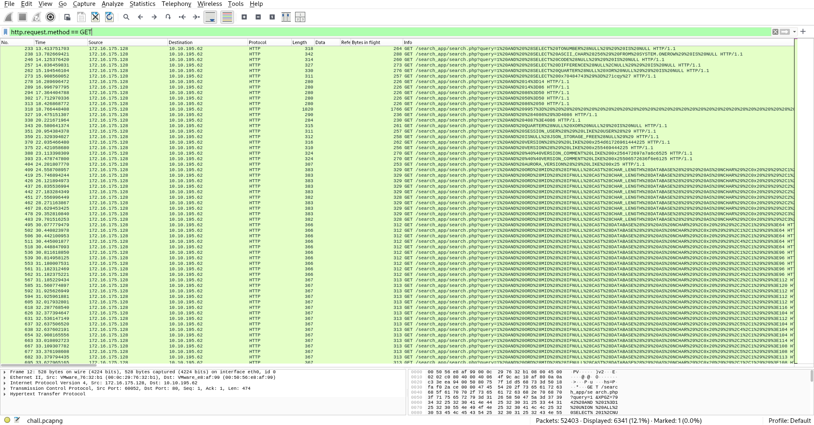
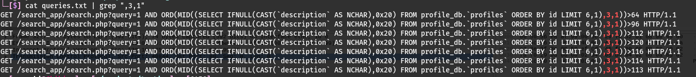
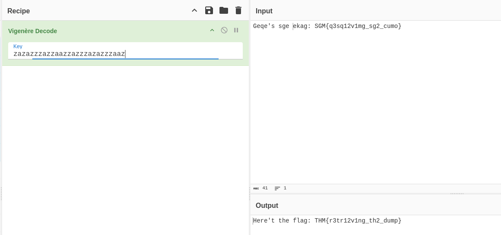

## Sequel Dump



In this challenge we were given a pcapng file capturing an attack that was aimed at a certain webserver, taking initial look at the pcap file we can see a bunch of sql queries made by sqlmap, without the present of anything else intresting



We notice that there are 2 types of responses for these requests : 

`<h2>Search Results:</h2>No results found.`

`<h2>Search Results:</h2><p><strong>Void:</strong> The cryptography expert who deciphers the toughest encryptions, searching for vulnerabilities in Void...s encoded fortress.</p>`

It seems like whenever the sql query is True it returns that cryptography sentence stored in profile.db, After taking a deeper look at the differelt sql queries made I've noticed an intresting trend in a couple of requests 

```
GET /search_app/search.php?query=1 AND ORD(MID((SELECT IFNULL(CAST(`description` AS NCHAR),0x20) FROM profile_db.`profiles` ORDER BY id LIMIT 6,1),4,1))>100 HTTP/1.1
GET /search_app/search.php?query=1 AND ORD(MID((SELECT IFNULL(CAST(`description` AS NCHAR),0x20) FROM profile_db.`profiles` ORDER BY id LIMIT 6,1),1,1))>71 HTTP/1.1
GET /search_app/search.php?query=1 AND ORD(MID((SELECT IFNULL(CAST(`description` AS NCHAR),0x20) FROM profile_db.`profiles` ORDER BY id LIMIT 6,1),4,1))>102 HTTP/1.1
GET /search_app/search.php?query=1 AND ORD(MID((SELECT IFNULL(CAST(`description` AS NCHAR),0x20) FROM profile_db.`profiles` ORDER BY id LIMIT 6,1),2,1))>102 HTTP/1.1
GET /search_app/search.php?query=1 AND ORD(MID((SELECT IFNULL(CAST(`description` AS NCHAR),0x20) FROM profile_db.`profiles` ORDER BY id LIMIT 6,1),4,1))>101 HTTP/1.1
GET /search_app/search.php?query=1 AND ORD(MID((SELECT IFNULL(CAST(`description` AS NCHAR),0x20) FROM profile_db.`profiles` ORDER BY id LIMIT 6,1),6,1))>64 HTTP/1.1
GET /search_app/search.php?query=1 AND ORD(MID((SELECT IFNULL(CAST(`description` AS NCHAR),0x20) FROM profile_db.`profiles` ORDER BY id LIMIT 6,1),3,1))>114 HTTP/1.1
.
.
.
```

Seems like our attacker is reading the flag one character at a time by comparing each character to a certain bound, Attempting to combine all of these chars would result in the following string 
```text
@@@@@` ```P0pp(HpDxhh$&Fdt'dGffe@r@q@e` @`p@p␐`x`xp␘thtp␜dr␞rhfssd␟``gf`p0`ehpp`␘dhhfpl$dejbkh␞``!da00f␟H`␘<$ 0g6␞H`9`!00:THH␟@ NTQ<`@BRN`EKpSLpxFMx@t|G z@r@`0q{`p`8p`00x4xHHt<2<t3r66r/sq3W3`k`101u2/HpzW<h/wk6W3lvan1kmf``a`p0ph\ghxHd^`ft<0_r6gs@HT3```pZ1p]ph^2xh/l_tndW@bvmk`cupupxm|n~}o
```

This might look like a bunch of gibberish at first glance however after taking a look at the flag format given `THM{**********_***_****}` We notice the presence of 2 underscores in the flag, checking our gibberish string we can see the present of _ between {} which confirms to us that the flag is stored in that string somehow, Now all we need to do is to find which chars are correct and which are wrong,

First idea that came to mind was that the correct chars would return a `The cryptography expert...` String and the wrong ones would return `No results found.` however there seemed to be over 200 requests returning that sentence thus that would not work in our case

After banging my head into a wall for bit I've realized that the only two params changing in those sql queries `6,1),3,1))>114` the `3` and `114` we know that the second params is the character ascii code, and the first one seems to signifiy it's order, however for each one of those there are multiple ones 



After checking for any trends for these characters I decided to take the underscores as a reference, both of them appeared to be the last sql query made with that order

Combining all the last chars from each order resulted in the following String `Geqe's\x1fsge\x1fe\x1fekag: SGM{q3sq12v1mg_sg2_cumo}` 

Bingo well that looks like our flag but a bit messed up, checking the sentence before it seems to say `Here's the flag:`

Remembering the phrase `<h2>Search Results:</h2><p><strong>Void:</strong> The cryptography expert who deciphers the toughest encryptions, searching for vulnerabilities in Void...s encoded fortress.</p>` it looks like we gonna need to do a bit of annoying crypto, welp my first guess was it looks like vigenere 

Taking it to cyberchef and attempting to guess the right key 



We get the following `Here't the flag: THM{r3tr12v1ng_th2_dump}`, it seems like the characters offset was either +1 or -1, looking at the flag it does not look quiete right thus simply replacing `2` with `3` gives us our final flag 

Flag: `THM{r3tr13v1ng_th3_dump}`


